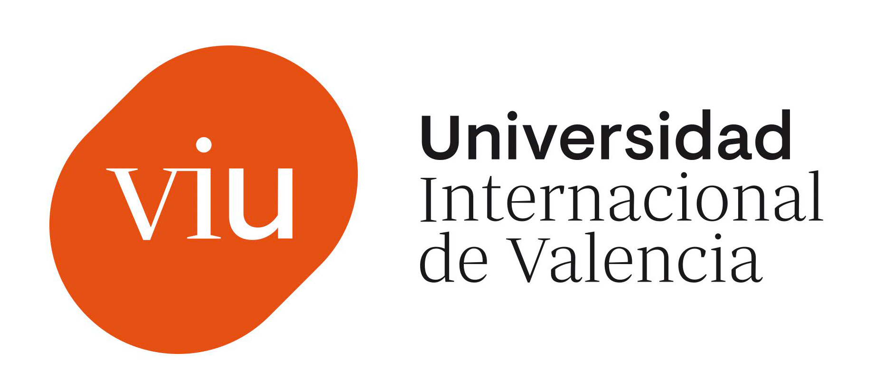

# MIAR - Master's in Artificial Intelligence

This repository contains the code, assignments, and projects developed throughout the **Master's in Artificial Intelligence (MIAR)** program.

Each course module is organized by number (from `01` to `08`) and corresponds to a specific subject in the program. Inside each folder, you'll find coursework including Jupyter notebooks, reports, scripts, and project materials.

## 📚 Content

1. [01-MIAR -- Python for AI](./01_miar_python)

    a. [Dataset exploration](./01_miar_python/dataset_exploration)

    b. Final proyect

2. [03-MIAR -- Optimization Algorithms](./03_miar_optim_alg)

    a. Class exercises
    
    b. Final proyect

3. [05-MIAR -- Supervised learning](./05_miar)

4. [06-MIAR -- Unsupervised learning](./06_miar)

5. [07-MIAR -- Neural networks and deep learning](./07_miar)

6. [08-MIAR -- Reinforcement learning](./07_miar)

7. [TFM-MIAR -- Master's Thesis](./tfm_miar)

## 🔗 Official Website 

For more information about the MIAR program, please visit the [official website](https://www.universidadviu.com/es/master-inteligencia-artificial).

<!--  

  

-->

## 🚀 Technologies

The projects and assignments in this repository use a variety of tools and frameworks, including but not limited to:

- Python
- TensorFlow / PyTorch
- Scikit-learn
- Jupyter Notebooks
- Pandas, NumPy, Matplotlib